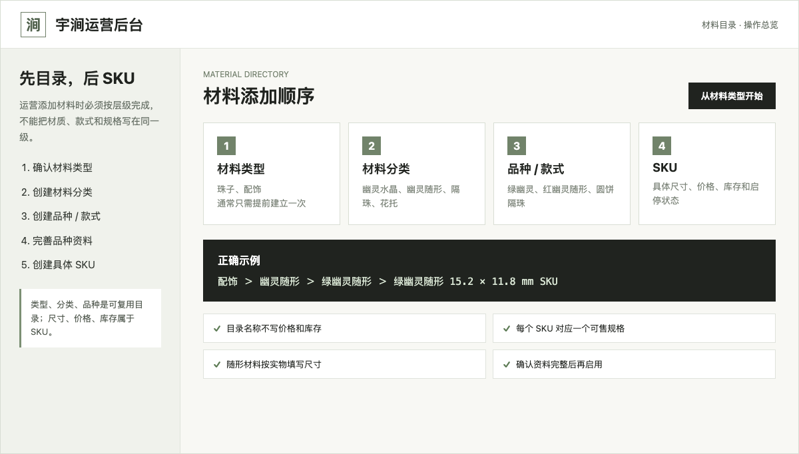
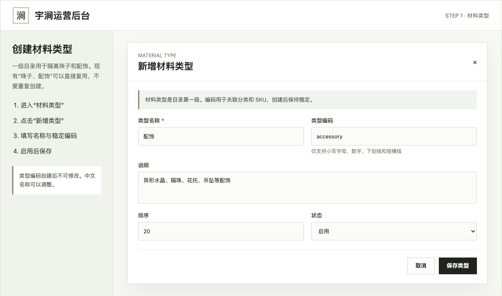
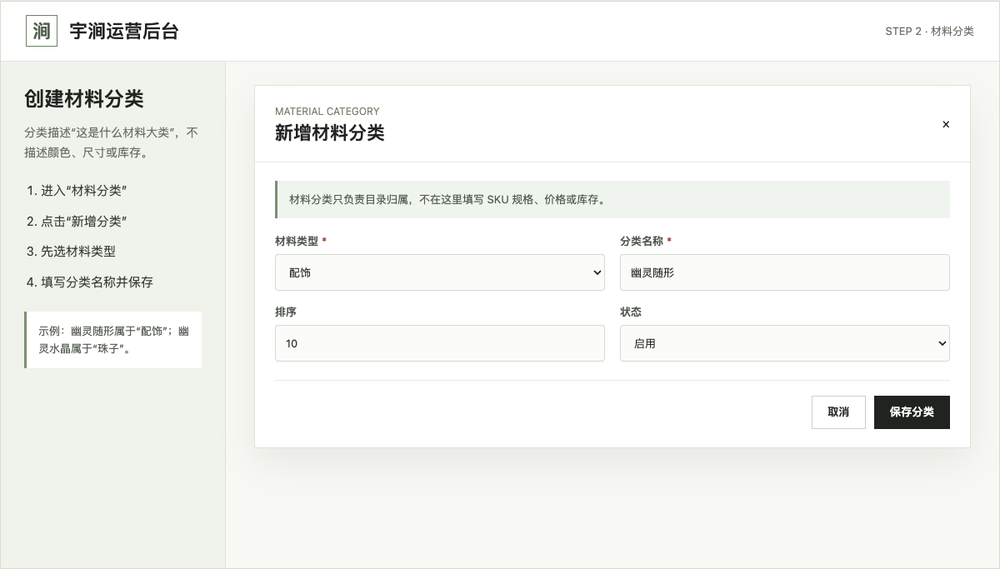
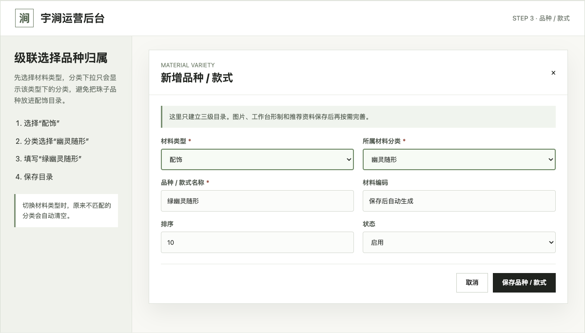
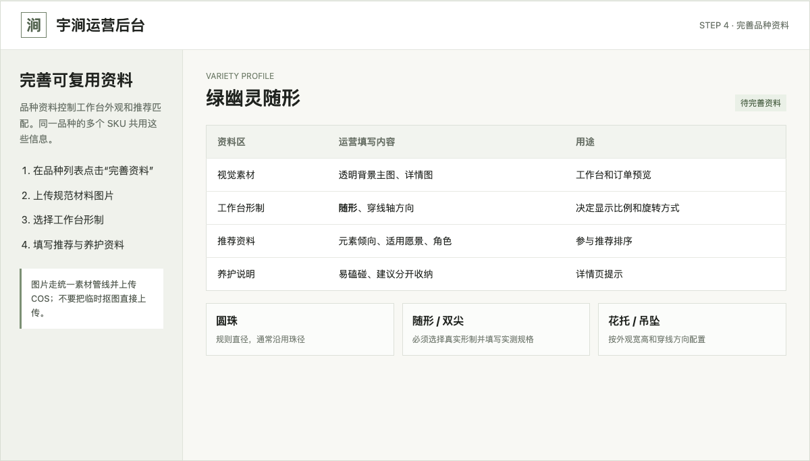
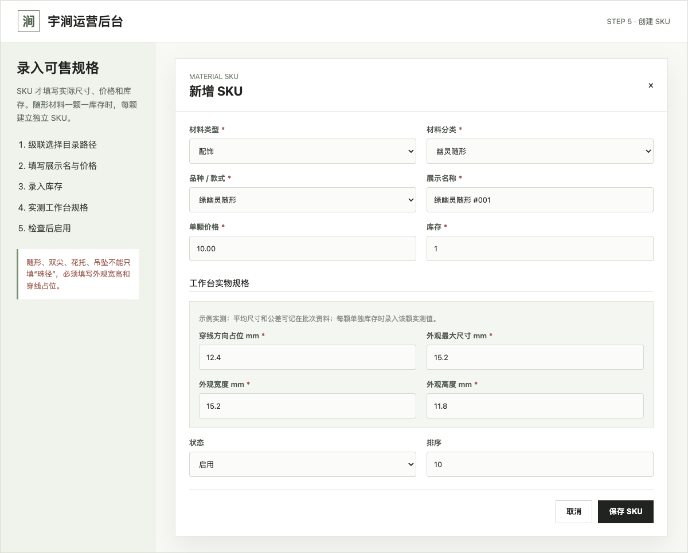

# 宇涧运营后台：材料添加图文指南

适用后台：[测试环境运营后台](https://api.yustream.cn/test-api/admin)

> 本指南图片中的名称、尺寸和价格仅用于演示操作，不代表真实库存或正式售价。新材料应先在测试环境验证，再按发布流程同步到正式环境。

## 一、先理解四级目录

材料必须按照以下顺序建立：

```text
材料类型 > 材料分类 > 品种 / 款式 > SKU
```



推荐使用以下结构：

| 材料类型 | 材料分类 | 品种 / 款式 | SKU 示例 |
| --- | --- | --- | --- |
| 珠子 | 幽灵水晶 | 绿幽灵 | 绿幽灵 8mm AAA |
| 珠子 | 幽灵水晶 | 红幽灵 | 红幽灵 10mm AA |
| 配饰 | 幽灵随形 | 绿幽灵随形 | 绿幽灵随形 #001 |
| 配饰 | 幽灵双尖 | 红幽灵双尖 | 红幽灵双尖 #001 |
| 配饰 | 隔珠 | 圆饼隔珠 | 圆饼隔珠 4×2mm |
| 配饰 | 花托 | 莲花花托 | 莲花花托 8mm |
| 配饰 | 吊坠 | 月亮吊坠 | 月亮吊坠 12×18mm |

目录只描述材料是什么；尺寸、价格、库存和启停状态只填写在 SKU。

## 二、创建材料类型

进入左侧 **材料类型**，点击 **新增类型**。



填写规则：

- 已有“珠子”和“配饰”时直接复用，不要重复创建。
- 类型名称可以调整，类型编码创建后不可修改。
- 类型编码使用小写英文，例如 `bead`、`accessory`。
- 新类型不能代替分类。例如“幽灵随形”属于配饰分类，不是新的材料类型。

## 三、创建材料分类

进入左侧 **材料分类**，点击 **新增分类**。



操作顺序：

1. 选择材料类型，例如“配饰”。
2. 填写分类名称，例如“幽灵随形”。
3. 设置排序与启用状态。
4. 点击 **保存分类**。

分类名称描述材料大类，不写颜色、尺寸、等级、价格或库存。

## 四、创建品种或款式

进入左侧 **品种 / 款式**，点击 **新增品种 / 款式**。



这里已经采用级联选择：

1. 先选择材料类型，例如“配饰”。
2. “所属材料分类”只显示该类型下面的分类。
3. 选择“幽灵随形”。
4. 填写品种名称“绿幽灵随形”。
5. 点击 **保存品种 / 款式**。

切换材料类型时，不属于新类型的原分类会自动清空，必须重新选择。

## 五、完善品种资料

品种保存后，在列表中点击 **完善资料**。



需要维护：

- **视觉素材**：透明背景主图和详情图，必须按素材管线处理并上传 COS。
- **工作台形制**：圆珠、随形、双尖、单尖、方糖、花托或吊坠等。
- **安装方式**：穿线、悬挂或其他实际安装方式。
- **穿线轴角度**：原图横向穿线填 `0`，竖向穿线填 `90`。
- **推荐资料**：元素倾向、适用愿景、材料角色和搭配规则。
- **养护信息**：易磕碰、避免暴晒、建议分开收纳等。

这些信息由同一品种下的 SKU 共用，不要把价格和库存写在这里。

## 六、创建具体 SKU

进入左侧 **SKU 管理**，点击 **新增 SKU**。



操作顺序：

1. 依次选择材料类型、材料分类和品种 / 款式。
2. 填写展示名称、单颗价格、重量和库存。
3. 填写珠径或外观最大尺寸。
4. 非圆珠材料继续填写工作台实物规格。
5. 检查资料完整后再把状态改为“启用”。
6. 点击 **保存 SKU**。

### 圆珠怎么填

| 字段 | 填写方式 |
| --- | --- |
| 珠径 / 外观最大尺寸 | 填实际珠径，例如 `8.0mm` |
| 穿线方向占位 | 可留空，系统沿用珠径 |
| 外观宽度 / 高度 | 可留空，系统按圆珠处理 |
| 库存 | 填该规格实际可售颗数 |

同一品种的 8mm、10mm、12mm 应分别建立 SKU。

### 随形、双尖、单尖和其他配饰怎么填

| 字段 | 填写方式 |
| --- | --- |
| 珠径 / 外观最大尺寸 | 填该颗材料的最大外观尺寸 |
| 穿线方向占位 | 填穿在线上实际占用的宽度，决定成串间距 |
| 外观宽度 | 填图片横向对应的真实宽度 |
| 外观高度 | 填图片纵向对应的真实高度 |
| 库存 | 每颗单独测量、单独管理时填写 `1` |

同一批次的平均尺寸和公差记录在批次或采购备注中；每颗独立 SKU 仍填写该颗实测值。不要把尺寸写进品种名称来代替规格字段。

### 隔珠、花托和吊坠怎么填

- 隔珠重点测量穿线方向占位、外观宽度和外观高度。
- 包珠隔片/花托选择形制 `bead_cap`、安装方式 `attached_side`，按单个实物维护 SKU；不要把“一对”固化成一个工作台单位。
- 包珠隔片应按实际包裹方向测量，填写适配主珠珠径和允许误差。工作台支持左侧、右侧或左右各装一个，相邻珠也允许各装一个形成背靠背效果。
- 吊坠需要选择正确安装方式，悬挂件不能按普通圆珠处理。
- 合金配饰必须使用透明背景实物图，避免工作台中出现白底或比例失真。

## 七、启用前检查

每个 SKU 上架前至少确认：

- 目录路径正确，没有把珠子放进配饰分类。
- 图片已经上传 COS，透明背景和比例正常。
- 品种形制与实物一致。
- 非圆珠材料的穿线占位、宽度和高度已填写。
- 价格为真实销售价格，不是测试价格。
- 库存不大于实际可售数量。
- 工作台、订单预览和材料列表显示正常。
- 测试环境验证完成后，才同步正式环境。

## 八、常见错误

| 错误操作 | 正确处理 |
| --- | --- |
| 重复创建“珠子”或“配饰” | 直接复用已有材料类型 |
| 把“绿幽灵”建成材料分类 | 建为“幽灵水晶”下的品种 |
| 把“随形”当作珠径规格 | 建为配饰分类或形制，并填写实测尺寸 |
| 在品种名称里写价格或库存 | 价格和库存只维护在 SKU |
| 随形材料只填最大尺寸 | 同时填写穿线占位、外观宽度和高度 |
| 图片直接使用临时抠图 | 按素材管线处理后上传 COS |
| 资料未完成就启用 | 先保持停用，验收工作台效果后再启用 |
