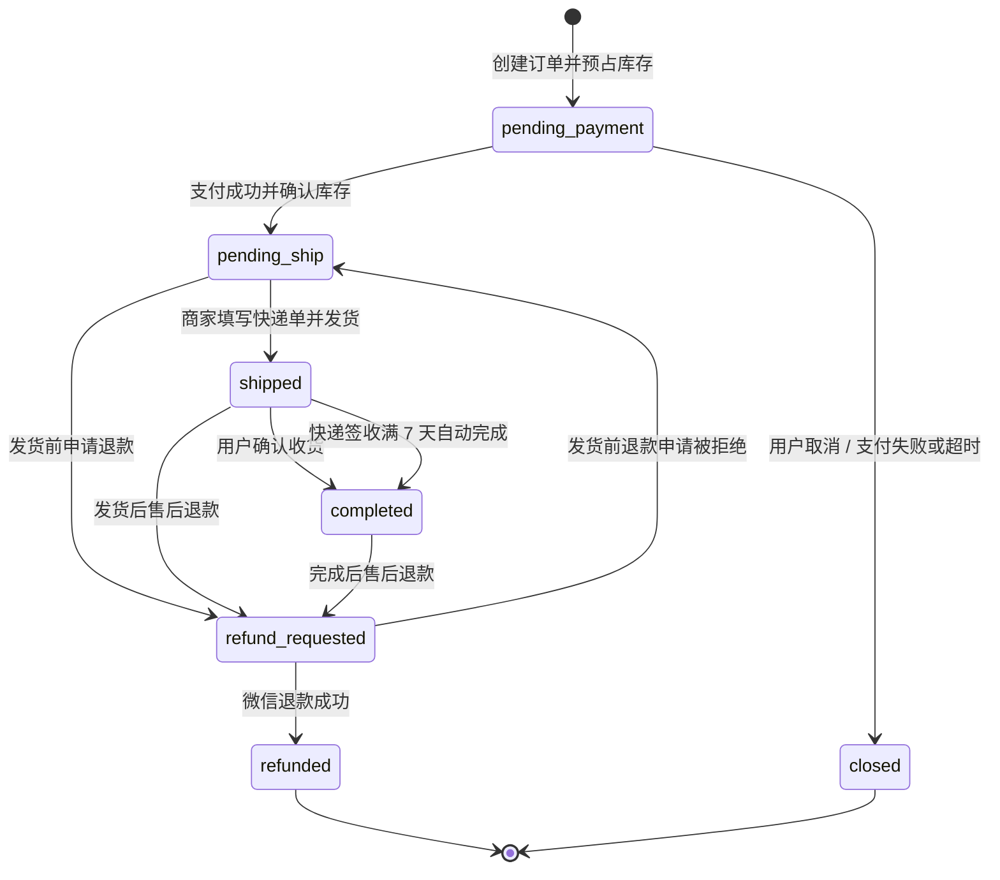

# 订单全状态流转测试报告

测试日期：2026-07-14
测试结论：**PASS（订单状态逻辑与当前 UI 验收通过）**

> 本结论只覆盖订单、支付状态、库存、物流、售后和对应页面展示。测试按约定将微信支付与微信退款视为正常返回，并通过受控 mock 验证后续状态；没有连接生产数据库，没有调用真实支付、退款或快递接口，也不代表整个项目已完成最终上线审批。

## 1. 测试环境与边界

- 后端：Python 3.12、临时隔离 SQLite 数据库，每个测试使用独立数据文件。
- 小程序：微信开发者工具模拟器，390 x 844 视口，测试环境编译。
- 支付与退款：使用服务层 mock 成功、处理中、失败、重试及乱序结果。
- 快递：使用本地构造的快递 100 已验签回调和查询结果。
- 数据安全：没有写入共享测试库或线上库，没有读取真实 Secret。
- 并发边界：SQLite 事务竞争已执行；4 组需要独立 MySQL 的专项测试因本机未配置隔离 MySQL 而跳过，未用 SQLite 代替 MySQL 行锁结论。

## 2. 当前主订单状态机



主状态与支付状态的合法组合为：

| 主状态 | 合法支付状态 | 业务含义 |
|---|---|---|
| `pending_payment` | `unpaid / processing` | 待支付或支付结果确认中 |
| `pending_ship` | `paid` | 已支付，工作室制作与打包 |
| `shipped` | `paid` | 已发货，可能处于待揽收、运输中或已签收待确认 |
| `completed` | `paid` | 用户确认收货，或签收 7 天后自动完成 |
| `refund_requested` | `paid` | 退款申请或退款处理尚未成功 |
| `refunded` | `refunded` | 原路退款成功，终态 |
| `closed` | `cancelled / expired / failed` | 未支付订单关闭，终态 |

所有 7 x 7 主状态转换和 7 x 7 主状态/支付状态组合均逐项验证。非法转换保持原状态并返回错误，不会写入虚假历史。

## 3. 物流与完成规则

物流是 `shipped` 主状态下的独立子状态，不应伪造成新的订单主状态：

1. 商家发货：`awaiting_pickup`，展示“已发货待揽收”。
2. 快递揽收：快递 100 状态 `1`，展示“已揽收”，尚未标记运输完成。
3. 运输中：快递 100 状态 `0` 等运输轨迹，展示“运输中”。
4. 快递签收：物流为 `signed`，订单仍保持 `shipped`，展示“已签收待确认收货”。
5. 用户主动确认：立即进入 `completed`，重复确认无副作用。
6. 用户未操作：从可靠的签收时间起满 7 天自动进入 `completed`，任务重复执行无副作用。
7. 用户确认与自动完成并发：只产生一条完成历史。
8. 乱序物流回调：已签收状态不会被较旧的运输中回调降级。

当前业务允许用户在商家已发货后主动确认收货，即使快递尚未回传签收；此时订单完成，但界面不会伪造“快递已签收”节点。

## 4. 售后状态机

当前可达的售后路径均已覆盖：

| 类型 | 路径 | 对主订单的影响 |
|---|---|---|
| 发货前直接退款 | `requested -> refund_pending -> refund_submitting/refunding -> resolved` | `pending_ship -> refund_requested -> refunded`，退款成功后库存只回补一次 |
| 发货前退款拒绝 | `requested -> rejected` | 主订单恢复一次 `pending_ship`，之后可正常发货 |
| 退货退款 | `requested -> awaiting_return -> returning -> refund_pending -> refund_submitting/refunding -> resolved` | 保留发货/完成历史；退款后商品进入人工质检，不自动回补可售库存 |
| 修改手围 | `requested -> service_processing -> resolved` | 不修改已完成订单的履约状态 |
| 重新穿制/维修 | `requested -> service_processing -> resolved` | 不修改已完成订单的履约状态 |
| 缺件/补发 | `requested -> service_processing -> resolved` | 不修改已完成订单的履约状态 |
| 其他服务 | `requested -> service_processing -> resolved` | 不修改已完成订单的履约状态 |
| 用户取消售后 | `requested/awaiting_return -> canceled` | 已提交退回物流后禁止取消 |
| 审核拒绝 | `requested -> rejected` | 必须填写拒绝原因 |

`approved` 仅保留为兼容标签，当前业务接口不会将售后工单持久化到该状态；实际审核动作直接进入明确的下一节点。

## 5. 覆盖结果

### 5.1 新增 120 条状态矩阵

- 49 条主订单状态两两转换。
- 49 条主订单状态与支付状态组合。
- 1 条创建、支付、发货、签收、确认收货完整正向链路。
- 1 条待支付取消及库存幂等释放。
- 1 条发货前退款成功、库存回补和终态保护。
- 1 条退款拒绝后恢复待发货。
- 2 条从已发货/已完成进入退货退款。
- 4 条修改手围、维修、补发、其他服务分支。
- 1 条售后拒绝、取消、退回物流约束集合。
- 5 轮发货与退款并发竞争。
- 5 轮支付与取消并发竞争。
- 1 条跨用户全业务阶段越权操作集合。

结果：`120 passed`。

### 5.2 后端全量回归

结果：`405 passed, 4 skipped, 3 warnings`。

已覆盖服务端定价、SKU 严格校验、订单幂等、库存预占与释放、支付回调去重与乱序、事务回滚、退款恢复、快递回调验签与去重、签收 7 天自动完成、售后工单、鉴权隔离、迁移和运行任务。

跳过项均为显式环境门禁：

- `tests/test_p0b_mysql_concurrency.py`：需要 `RUN_P0B_MYSQL_INTEGRATION=1`。
- `tests/test_p1a_mysql_webhooks.py`：需要 `RUN_P1A_MYSQL_INTEGRATION=1`。
- `tests/test_p1b_mysql_reports.py`：需要 `RUN_P1B_MYSQL_INTEGRATION=1`。
- `tests/test_p1c_mysql_runtime.py`：需要 `RUN_P1C_MYSQL_INTEGRATION=1`。

3 条警告为既有依赖弃用提示：Starlette TestClient 的 `httpx` 兼容警告，以及 `app/admin_service.py` 两次 `datetime.utcnow()` 警告；本轮没有新增测试失败。

### 5.3 小程序与运营端

- 全部 JS 测试：`86 passed`。
- 定向订单详情与运营端轨迹测试：`15 passed`。
- 小程序环境隔离检查：通过。
- JavaScript 语法检查：45 个文件通过。
- 运营端 `admin.js` 语法检查：通过。
- `git diff --check`：通过。

### 5.4 微信模拟器 12 个状态场景

以下场景全部通过页面数据、状态标题、时间线、按钮和物流卡片断言：

1. 待支付。
2. 支付处理中。
3. 待发货/制作打包中。
4. 已发货待揽收。
5. 运输中。
6. 已签收待用户确认。
7. 已完成。
8. 发货前退款申请。
9. 发货后退款申请。
10. 发货前退款完成。
11. 完成后退款完成。
12. 已取消。

结果：`12/12 passed`。模拟器数据通过页面方法注入隔离状态，没有写入后端数据库。

## 6. 本轮发现并修复的问题

| 问题 | 影响 | 修复与验证 |
|---|---|---|
| 发货前退款仍显示物流卡片 | 用户会误以为商品已经发出 | 物流展示改为必须有真实发货/单号/轨迹证据；售前退款模拟器验证通过 |
| 待发货卡片仍叫“物流信息” | 制作阶段与物流阶段语义混淆 | 改为“制作进度 / 查看进度”，发货后再显示“物流信息 / 查看物流” |
| 六节点状态条在窄屏截断 | 最新签收/完成节点不可见 | 增加稳定节点宽度、横向滚动和当前进度定位；签收场景验证通过 |
| 运营端把所有退款申请推断为已发货 | 售前退款生成虚假发货节点 | 改为仅根据状态历史和真实快递单判断 |
| 运营端退款完成后丢失发货链路 | 无法审计订单实际履约过程 | 退款轨迹保留真实发生的待发货、发货、揽收、运输、签收和完成节点 |
| 用户手动确认会被显示成快递签收 | 混淆用户行为与承运商事件 | “快递签收”只认物流证据，“订单完成”只认完成历史，二者独立展示 |

## 7. 实际执行命令

```text
.venv_codex/bin/python -m pytest -q tests/test_order_state_machine_matrix.py -p no:cacheprovider
# 120 passed in 1.53s

.venv_codex/bin/python -m pytest -q --ignore=tests/minium -p no:cacheprovider -rs
# 405 passed, 4 skipped, 3 warnings in 6.02s

cd miniprogram && npm test
# 86 passed

cd miniprogram && npm run build:check
# environment isolation passed; checked 45 JavaScript files

node --test tests/js/admin-after-sale.test.js tests/js/order-detail-materials.test.js
# 15 passed

node --check static/admin/admin.js
# passed

cd /tmp/yujian-order-ui-smoke && node order-states.js
# 12 simulator scenarios passed

git diff --check
# passed
```

## 8. 剩余风险与上线前人工项

| 项目 | 状态 | 说明 |
|---|---|---|
| 真实微信支付/退款 | 未执行，符合本次边界 | 上线前需在微信沙箱或受控小额订单验证一次完整回调 |
| 快递 100 真实推送时效 | 未执行，符合本次边界 | 需用真实测试单验证订阅、揽收、签收和乱序推送 |
| MySQL 行锁专项 | BLOCKED | 本机无隔离 MySQL；4 个专项门禁未运行，不得把 SQLite 结果解释为 MySQL 行锁验证 |
| iOS/Android 真机 | 待人工验收 | 模拟器已通过；仍需各一台真机检查横向状态条、底部安全区和大字体 |
| 依赖弃用警告 | P3 | 不影响本轮结果，后续升级 Starlette/httpx 并替换 `datetime.utcnow()` |

## 9. 最终判断

订单状态机、支付状态配对、库存副作用、物流子状态、签收完成规则、退款/退货/非退款售后、并发互斥、幂等和用户隔离均通过当前自动化与模拟器验收。本轮没有发现未修复的订单状态 P0 或 P1。

因此，本次**订单全状态流转验收为 PASS**。正式放量前仍需完成真实微信/快递测试单和 iOS/Android 真机 smoke；若上线数据库为 MySQL，还应在隔离 MySQL 环境执行四个显式门禁。
