# 小红书天然水晶 DIY 灵感：首批 30 款

详细复刻珠序表（含表内图片、珠径、数量与顺时针排列）：[30 款珠序排列组合表](30款珠序排列组合表.md)

检索日期：2026-07-15
用途：宇涧水晶设计研究与 DIY 方案储备
来源：小红书公开笔记，图片为研究时的 App 页面截图；原作者与原帖链接均保留。

> 说明：以下材质拆解优先采用原帖文字；原帖未写明的部分为依据图片做的设计判断，不构成宝石鉴定。点赞/收藏数为检索时页面显示值，会随时间变化。少数参考款用了兔毛幽灵、绿阿塞等相对小众珠材，本文只借其构图，量产建议已改为常见珠材。

## 先看结论

这批参考里最值得复用的不是某一颗稀有珠，而是五种稳定的设计方法：

1. **同色阶 + 透明度变化**：如紫水晶、海蓝宝、粉晶，用深浅和透度建立层次。
2. **中性色打底 + 一处功能色**：白水晶、灰月光、银曜石做底，只保留一组蓝、绿、粉或黄焦点。
3. **圆珠为主体 + 1—3 颗异形珠**：方糖、桶珠、算盘珠负责节奏，不让整串都变成配件展览。
4. **材质对半或三段式分区**：适合 DIY 工作台理解，也方便用户替换一个分区而不破坏整串。
5. **单主角原则**：主珠、吊坠、蝴蝶结、月亮配件只能选一个最强焦点，其余退为陪衬。

优先建立的常用珠材库：白水晶、灰/蓝月光、海蓝宝、紫水晶、粉晶、草莓晶、东陵玉、绿萤石、黄水晶、茶晶、虎眼石、黑曜石/银曜石、石榴石。它们覆盖这 30 款绝大多数配色，不需要依赖非常冷门的单珠。

## 30 款快速总览

编号与下方逐款分析一致，每张总览包含 6 款。

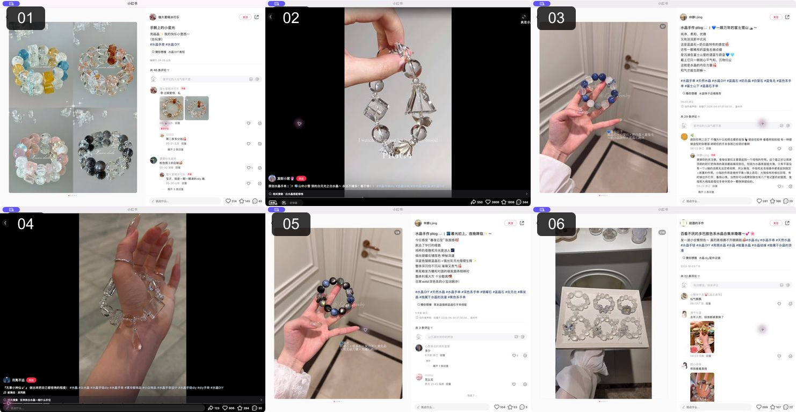

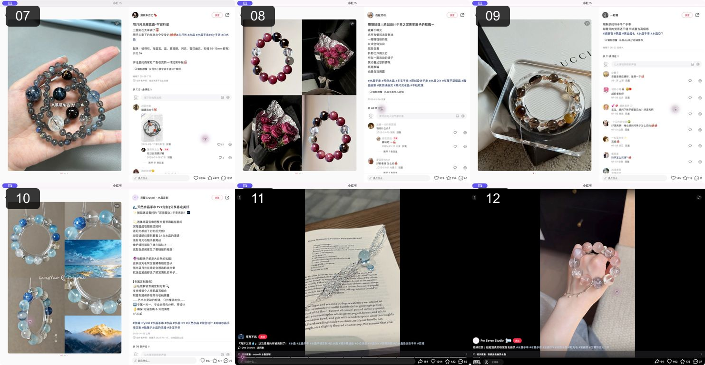

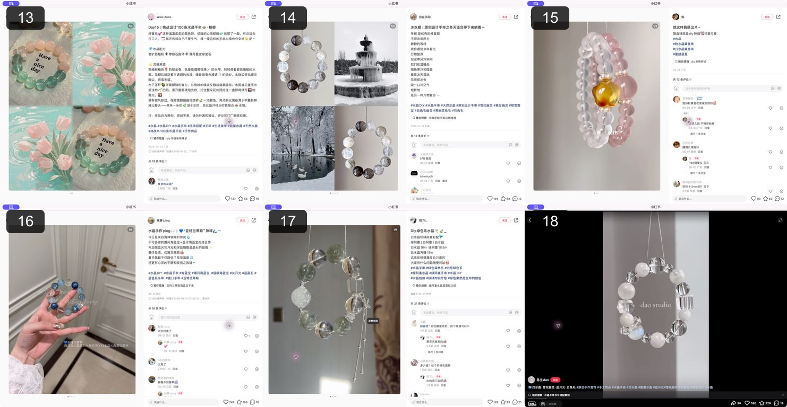

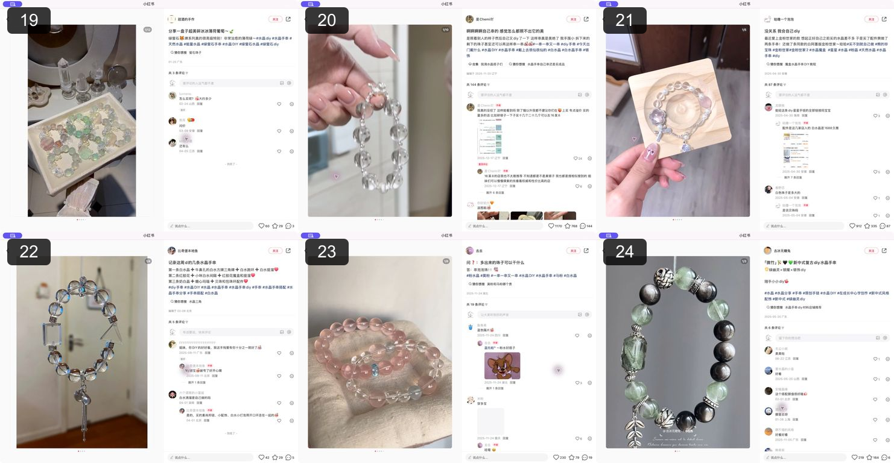

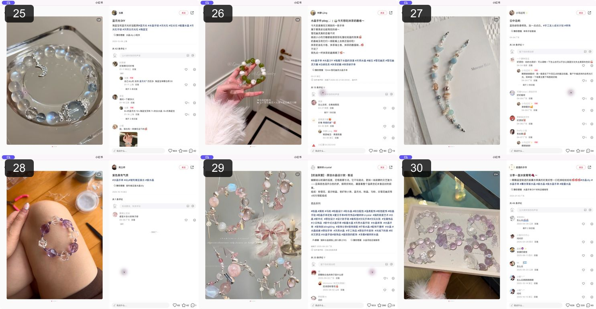

---

## 01｜白透四色方案：手腕上的小星光

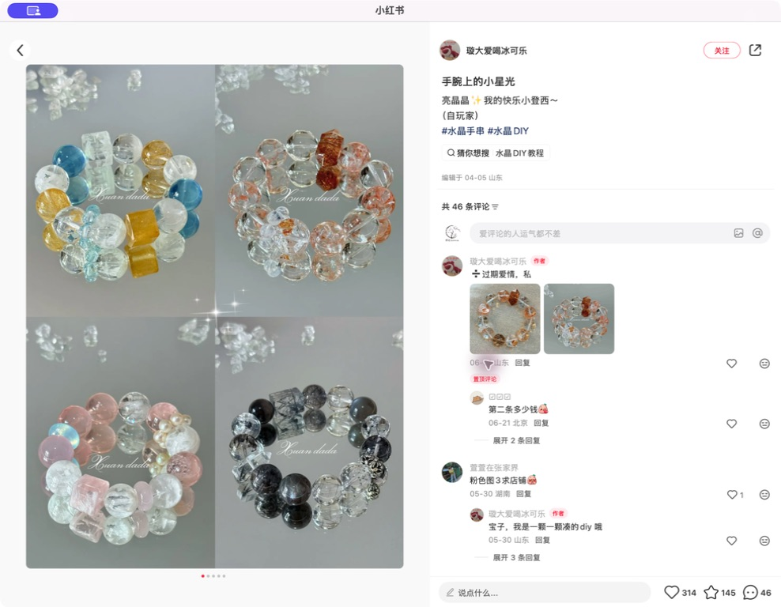

来源：[@璇大爱喝冰可乐](http://xhslink.com/o/6FEKXJQ1nmX) · 314 赞 / 145 收藏

- **构成**：以白水晶和透明异形珠为共同骨架，分别加入海蓝宝+黄水晶、浅橙晶、粉晶+珍珠、灰月光+茶晶，形成四套同结构配色。
- **设计理念**：先固定透明骨架，再替换 30% 功能色；适合做成可配置的系列款。
- **优化**：每串只保留一种异形珠（方糖或桶珠），彩色珠不超过总珠数的 1/3，视觉会更高级。
- **替换**：黄色可用黄水晶或黄玉髓；浅橙用太阳石；灰黑用灰月光+茶晶，都是常见且好采购的组合。

## 02｜白水晶银饰：山中小雪

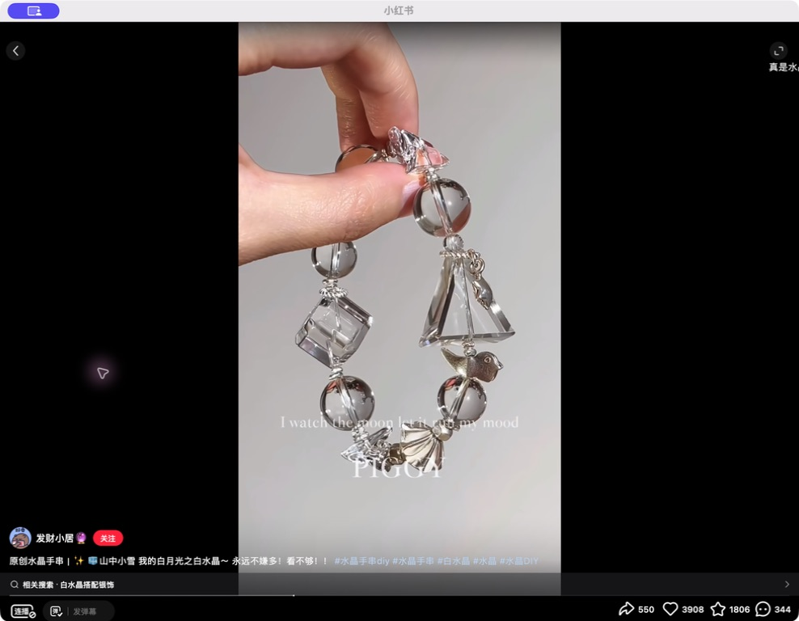

来源：[@发财小居🔮](http://xhslink.com/o/7lNAU1bTws5) · 3908 赞 / 1806 收藏

- **构成**：大颗白水晶/茶色透明圆珠为主体，加入白水方糖、几何银饰和长垂坠，明显不对称。
- **设计理念**：用透明材质模拟冰雪，以银色几何制造“冷、利、亮”的现代感。
- **优化**：原款配件偏重，量产可改为 10—12mm 主珠，长吊坠只留一处，避免翻腕和硌手。
- **替换**：茶色透明珠用茶晶；高价大颗白水可换 8—10mm 白水晶+1 颗 12mm 主珠，效果仍成立。

## 03｜蓝白分区：一眼万年的富士雪山

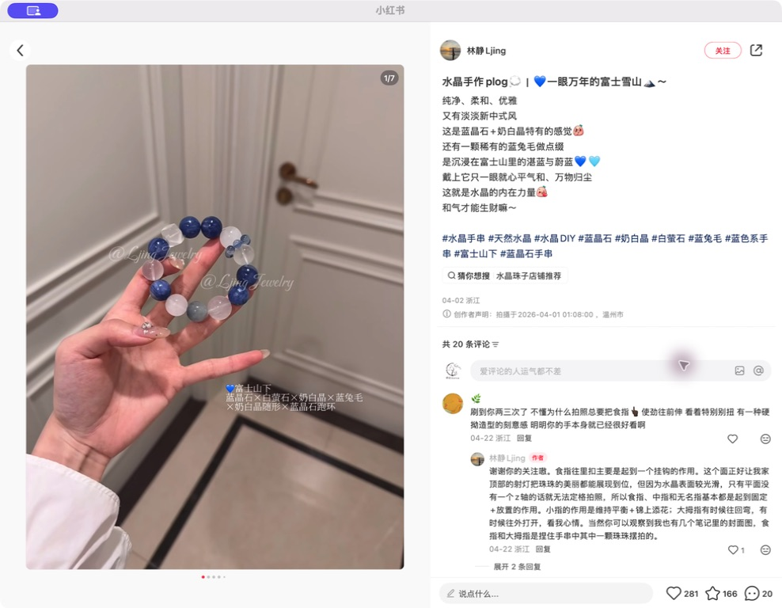

来源：[@林静Ljing](http://xhslink.com/o/1tmf7pDW0T) · 281 赞

- **构成**：深蓝珠、雾蓝珠、奶白珠与少量粉灰透明珠分段排列，整体以圆珠为主。
- **设计理念**：深蓝代表山影，奶白代表积雪，雾蓝作为两者之间的空气层。
- **优化**：压缩粉色比例，只留 1—2 颗过渡；深蓝段与奶白段建议 4:3，主题更明确。
- **替换**：蓝晶石可换深色海蓝宝或蓝纹玛瑙；奶白晶可换白月光或白玉髓，降低采购难度。

## 04｜清冷异形：无事小神仙

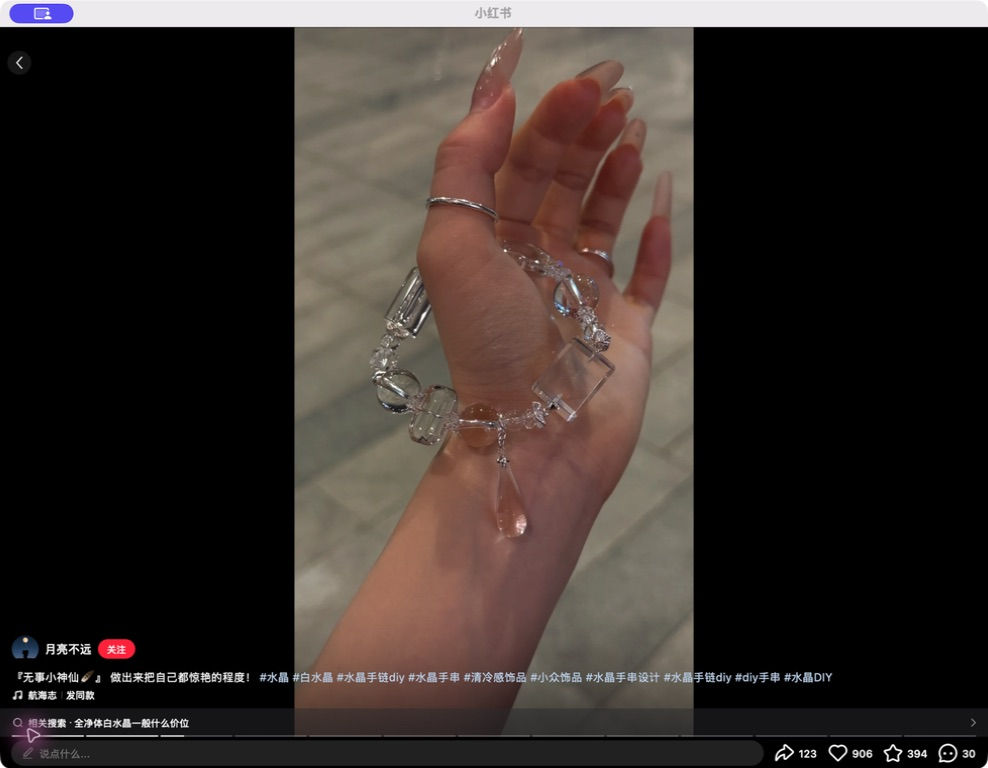

来源：[@月亮不远](http://xhslink.com/o/1P2FkYEILQ3) · 906 赞 / 394 收藏

- **构成**：白水晶圆珠、方糖/长方体异形珠、细银链和单侧水滴坠，留白明显。
- **设计理念**：把传统满珠手串改成“珠链混合”，轻盈感来自珠子之间的空隙。
- **优化**：日常佩戴版应减少尖角异形，链段控制在腕围的 1/4 以内；水滴坠缩短到 15—20mm。
- **替换**：全部用白水晶即可完成；若需要更柔和，可用白月光替代一半圆珠。

## 05｜黑蓝夜色：暮光初上

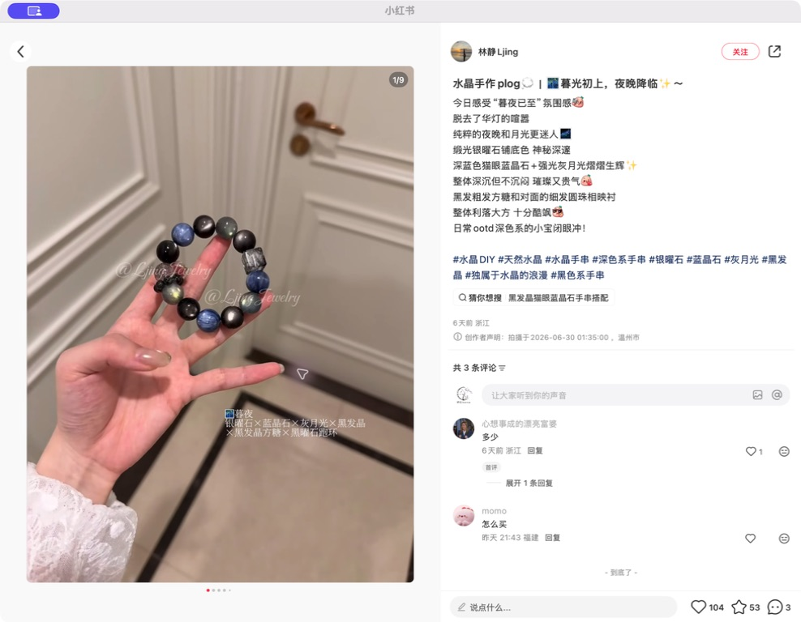

来源：[@林静Ljing](http://xhslink.com/o/7s8HyXeJiht) · 104 赞

- **构成**：银曜石/黑曜石做暗底，深蓝珠与灰蓝珠穿插，银色隔片控制节奏。
- **设计理念**：用黑—灰—蓝的低明度递进表现夜色，不靠大面积黑色营造压迫感。
- **优化**：黑色珠控制在 40% 左右，蓝色集中在正面视觉区；银隔片不超过 4 处。
- **替换**：深蓝猫眼或蓝晶石可换蓝纹玛瑙；银曜石可换普通黑曜石+灰月光，成本更稳定。

## 06｜多巴胺模块：彩色多宝合集

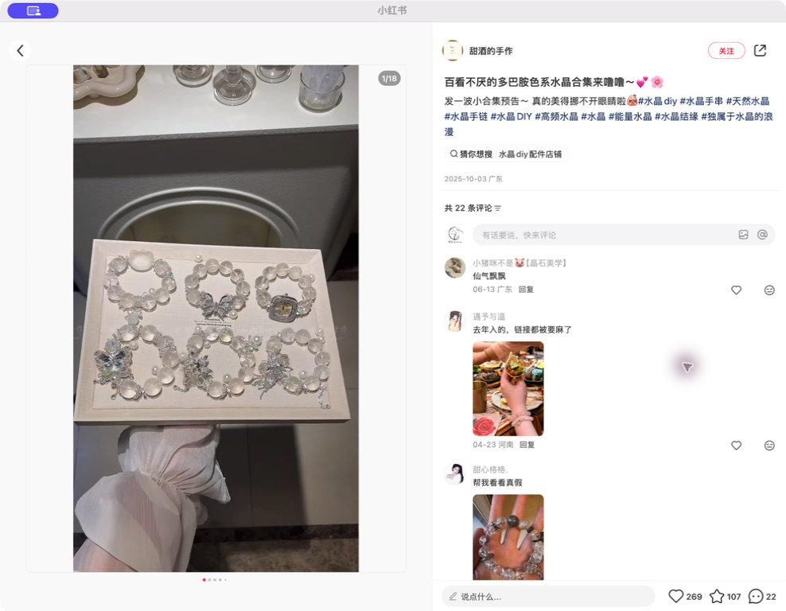

来源：[@甜酒的手作](http://xhslink.com/o/4o5OyMrod4Q) · 269 赞

- **构成**：白水晶为统一底材，每串选择 2—3 种高纯度彩色珠和少量银饰，形成系列化多宝。
- **设计理念**：不是随机彩虹，而是“透明底 + 两个邻近色 + 一个小撞色”。
- **优化**：每串最多三种主色，异形珠保持同一种切型；这样在社区瀑布流里既丰富又不乱。
- **替换**：可只使用紫水晶、黄水晶、海蓝宝、东陵玉、粉晶五种常见珠材轮换。

## 07｜灰月光三圈：宇宙行星

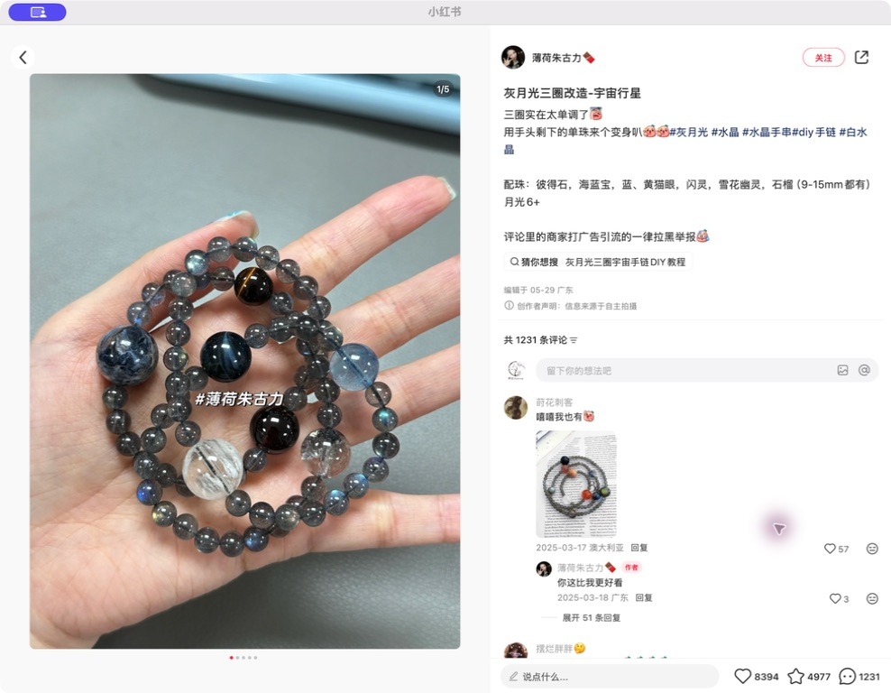

来源：[@薄荷朱古力🍫](http://xhslink.com/o/8Wa1vaaSNzr) · 8394 赞

- **构成**：小粒灰月光三圈为轨道，白水晶、黑灰主珠与金属圆件作为“行星”。
- **设计理念**：用大小级差和多圈结构讲宇宙轨道，而非堆砌不同颜色。
- **优化**：宇涧可先做单圈大众版：6—8mm 灰月光为底，正面 3 颗 10—12mm 主珠；三圈作为进阶 DIY。
- **替换**：大颗灰月光可换茶晶、白水晶与黑曜石三颗组合，主题仍清晰。

## 08｜深红冷银：锡箔玫瑰

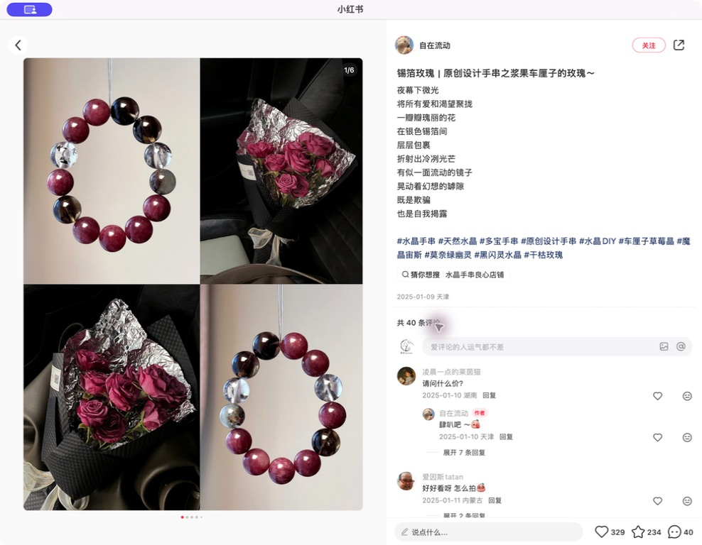

来源：[@自在流动](http://xhslink.com/o/37glzLmzSgV) · 329 赞

- **构成**：深红圆珠为主，透明/烟灰珠做间隔，冷银玫瑰或银箔感配件位于正面。
- **设计理念**：红色负责情绪，银色负责降温，避免红+金常见的节庆感。
- **优化**：深红珠保持同一饱和度，透明珠只做 2—4 颗过渡；玫瑰配件只留一个中心。
- **替换**：红色可用石榴石、红玛瑙或草莓晶；想更轻盈可用粉晶替代一半深红珠。

## 09｜棕金大地：虎眼石×茶晶

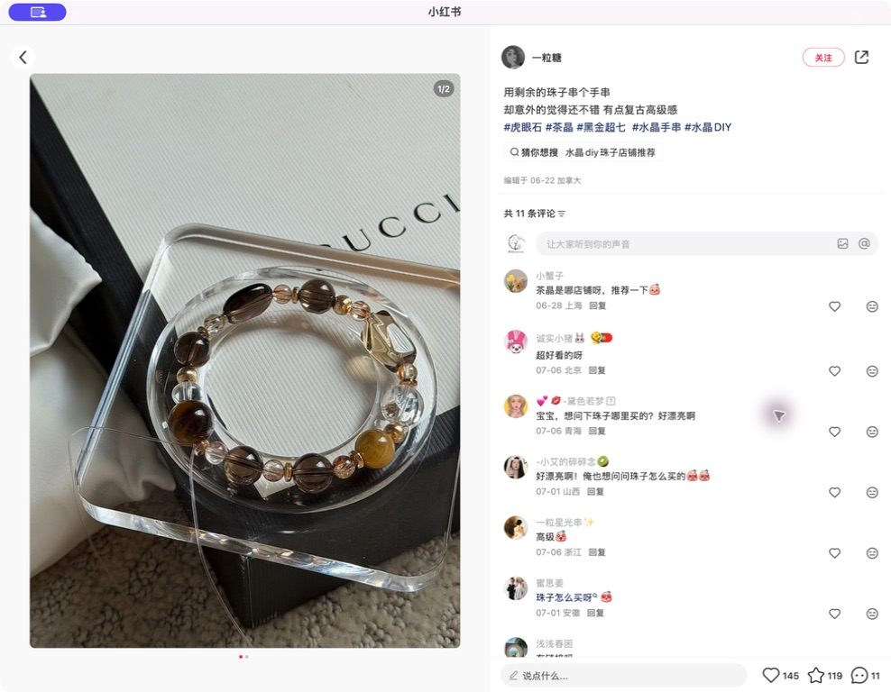

来源：[@一粒糖](http://xhslink.com/o/8tCPIy9VO5U) · 145 赞

- **构成**：虎眼石、茶晶、透明白水晶与少量黄晶/金属隔片混排，色调集中在棕—金—透明。
- **设计理念**：利用虎眼石光带与茶晶透度形成“实—透”对比，适合中性和男款。
- **优化**：去掉黑金超七等价格和品控波动较大的珠材，珠径统一 10mm，再用 2 颗 12mm 虎眼做焦点。
- **替换**：黑金超七直接换黑曜石；发晶换黄水晶；综合色系不会受影响。

## 10｜深浅蓝环：深海星轨

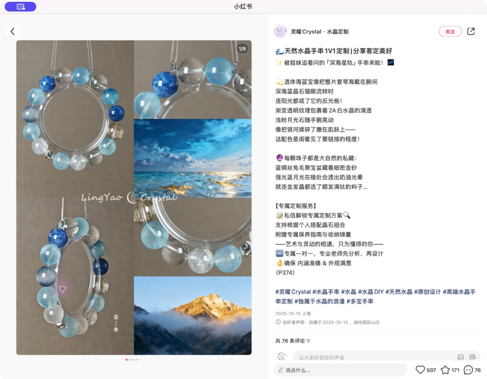

来源：[@灵曜Crystal · 水晶定制](http://xhslink.com/o/4lVZzJYGlV2) · 507 赞

- **构成**：浅海蓝宝、乳白/蓝月光与少量深蓝珠组成三档蓝色，细银隔件像轨道节点。
- **设计理念**：浅蓝负责水感，深蓝负责深度，白色负责呼吸感。
- **优化**：深蓝珠只放 2—3 颗并集中一侧，避免平均散布导致花；银隔片控制在 3 处。
- **替换**：深蓝晶石换蓝纹玛瑙；高净海蓝宝可用普通海蓝宝+白水晶提升整体通透感。

## 11｜链式留白：海洋之泪

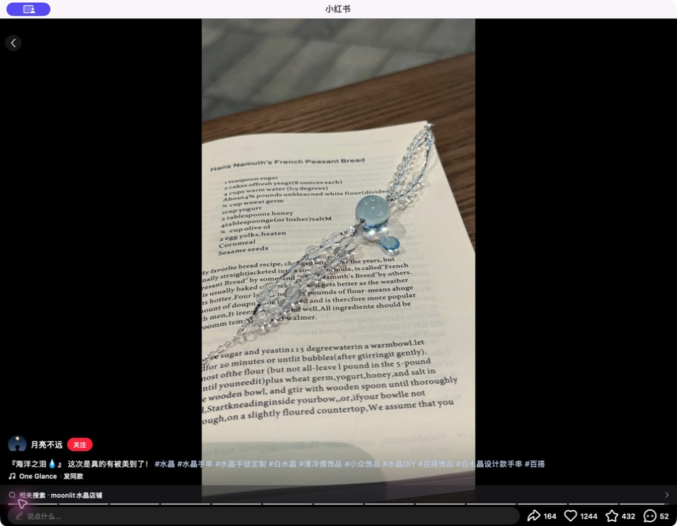

来源：[@月亮不远](http://xhslink.com/o/6WkgbzGZXZk) · 1244 赞 / 432 收藏

- **构成**：银链做主体，单颗浅蓝主珠与少量白水晶小坠集中在正面，珠子比例很低。
- **设计理念**：让一颗海蓝色主珠成为唯一视觉中心，适合轻珠宝而非传统满珠串。
- **优化**：需要绕线和金属连接能力；DIY 工作台可提供“链式模板”，限制坠件数量，避免缠绕。
- **替换**：主珠用海蓝宝、蓝月光或蓝纹玛瑙均可；小坠统一用白水晶，不必增加冷门珠材。

## 12｜柔粉淡紫：兔毛幽灵构图的常见珠版

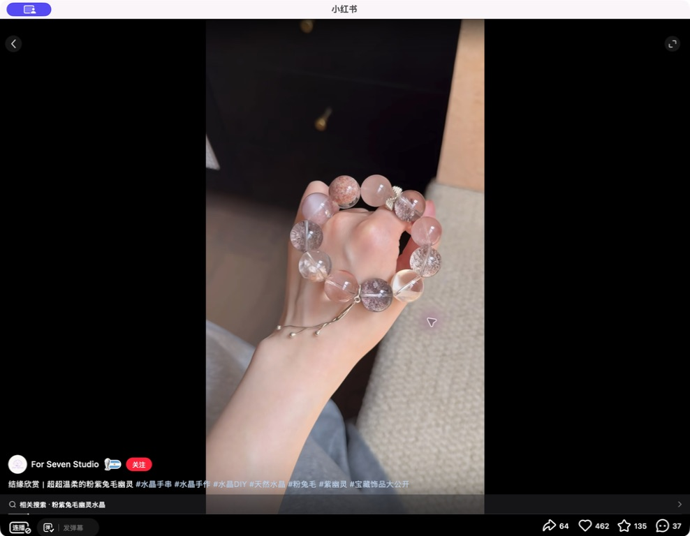

来源：[@For Seven Studio](http://xhslink.com/o/4iX47tHnRtp) · 462 赞

- **构成**：粉色圆珠为主体，淡紫透明珠和白水晶作焦点，配一个短小银坠。
- **设计理念**：相邻色粉—紫渐变，整体温柔但不幼态。
- **优化**：不建议量产时依赖粉兔毛/紫幽灵；直接用粉晶 60% + 紫水晶 25% + 白水晶 15%。
- **替换**：预算版用粉晶+紫水晶；质感版加入 1—2 颗草莓晶，不改变珠序。

## 13｜粉绿撞色：Day15·粉郁

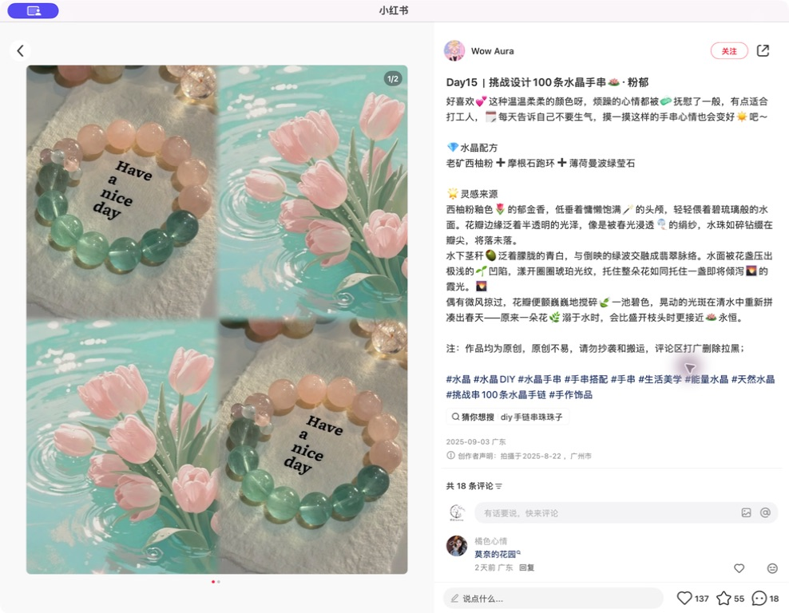

来源：[@Wow Aura](http://xhslink.com/o/3flEt9EgTPz) · 137 赞

- **构成**：蜜桃粉与薄荷绿分区，透明浅色珠作为连接，呈现接近 1:1 的双色环。
- **设计理念**：用低饱和互补色制造夏日清新感，重点是“分区”而不是交替一颗一颗排。
- **优化**：粉绿比例建议 6:4，正面加入 1 颗白水晶主珠，能让两个色块更自然地过渡。
- **替换**：粉色用粉晶/草莓晶，绿色用东陵玉/绿萤石，均为常见珠材。

## 14｜黑白冰霜：冰冻期

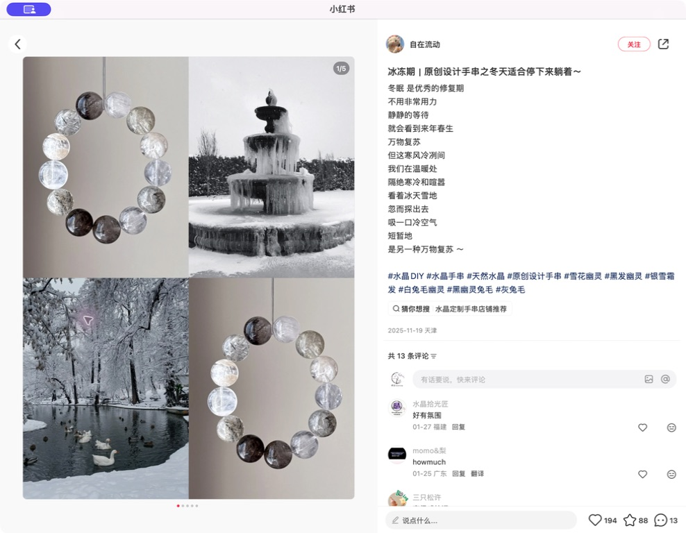

来源：[@自在流动](http://xhslink.com/o/1vK4ZRGAQAN) · 194 赞

- **构成**：白水晶、灰月光、茶晶/黑曜石按由浅到深分区，珠径有轻微级差。
- **设计理念**：以冬日结冰的灰度层次取代复杂色彩，主题克制。
- **优化**：将最深的黑色珠缩减到 2 颗，透明白水不少于一半；正面用 1 颗方糖即可。
- **替换**：灰月光不足时用茶晶+白水晶组合；黑珠统一用黑曜石。

## 15｜三圈粉晶：算盘珠焦点

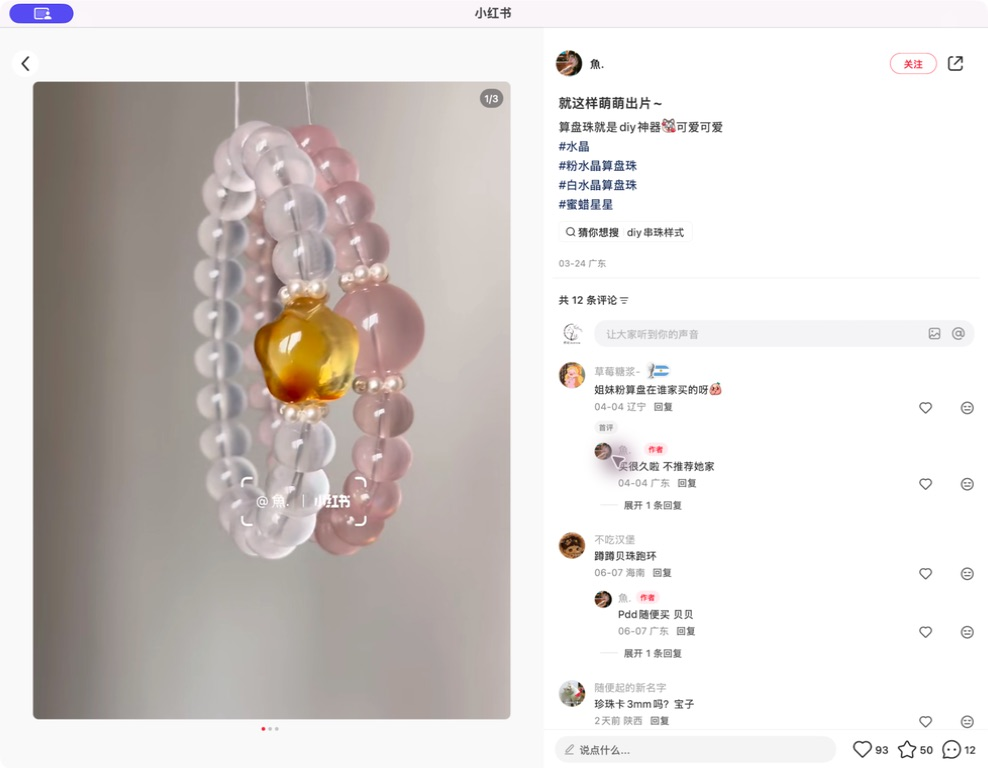

来源：[@魚.](http://xhslink.com/o/2S7GZ7lJ8FP) · 93 赞

- **构成**：粉晶/白水晶算盘珠做三圈，正面放一颗大号蜜蜡色圆形主珠。
- **设计理念**：扁珠形成细密纹理，大圆珠形成尺度反差。
- **优化**：天然蜜蜡非水晶且成本高，宇涧版改用黄水晶或太阳石；三圈每圈只设置一个主焦点。
- **替换**：粉晶算盘珠可换 6mm 粉晶圆珠；黄色主珠用 12mm 黄水晶，供应更稳。

## 16｜高对比海蓝：亚特兰蒂斯神域

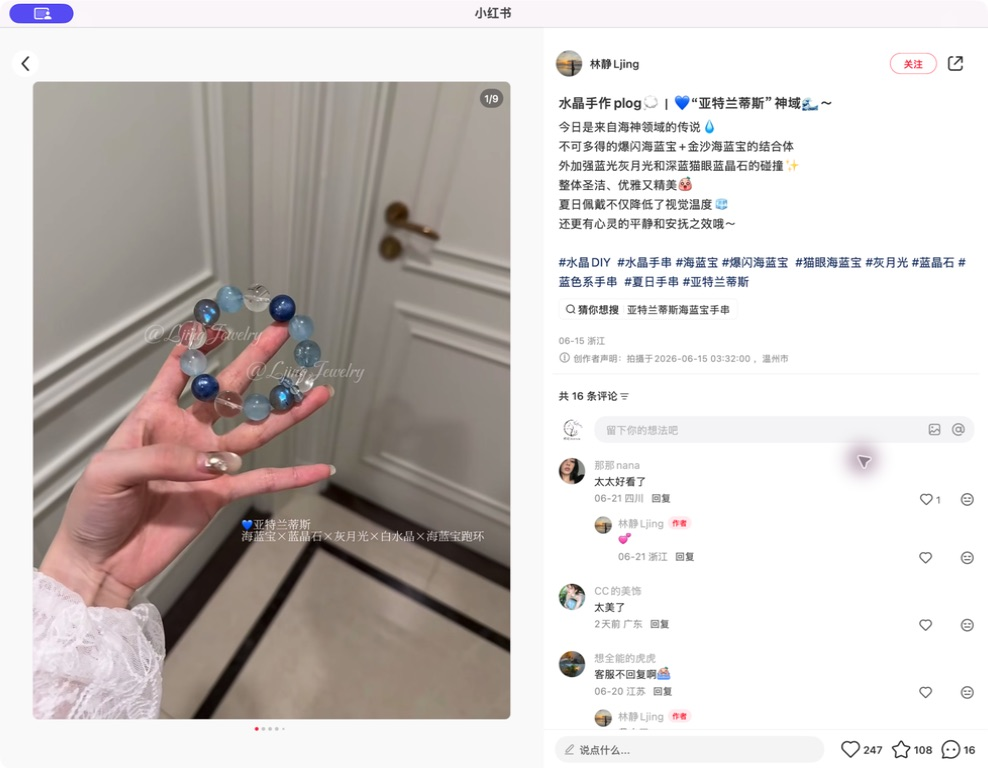

来源：[@林静Ljing](http://xhslink.com/o/7k0uSVv4KPo) · 247 赞

- **构成**：高净海蓝、灰蓝月光、深蓝珠与少量透明/粉灰珠并置，蓝色层级比 10 号更强。
- **设计理念**：用明亮浅蓝表现水面，用少量深蓝表现海沟，形成戏剧性。
- **优化**：减少粉灰过渡珠，只保留白水晶；珠径统一后以深蓝主珠做 3 颗三角构图。
- **替换**：金沙海蓝宝等高价品种可用普通海蓝宝；深蓝用蓝纹玛瑙或深色蓝晶石。

## 17｜绿白通透：绿色系水晶 DIY

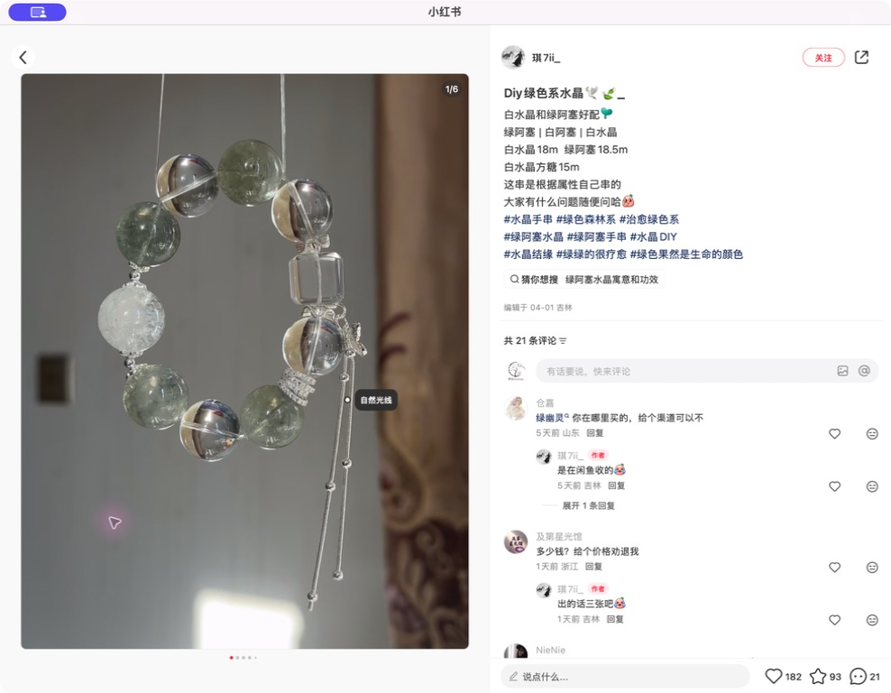

来源：[@琪7ii_](http://xhslink.com/o/2OqvaQGRLgp) · 182 赞

- **构成**：透明绿圆珠与白水晶圆珠交替，加入白水方糖/长方体和细银坠。
- **设计理念**：绿色负责自然感，白水晶让大颗绿珠不显沉重。
- **优化**：原帖绿阿塞相对小众，量产不要依赖；异形白水晶保留 1—2 颗即可。
- **替换**：绿色全部换东陵玉、绿萤石或浅色绿幽灵，按预算分级。

## 18｜纯净月光：白水晶×蓝月光

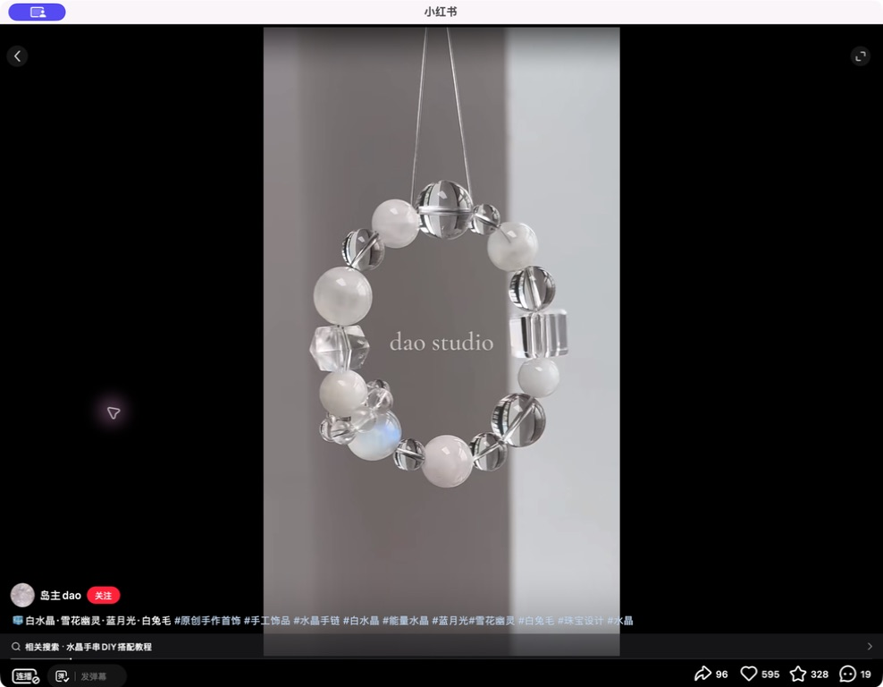

来源：[@岛主dao](http://xhslink.com/o/6s6MkNnyfLy) · 595 赞

- **构成**：白水晶圆珠、白月光/蓝月光、透明桶珠和一处细银坠，白色占绝对主体。
- **设计理念**：不靠多色，只用透明、乳白、蓝光三种光学质感做层次。
- **优化**：雪花幽灵和白兔毛可删减，保留白水晶+蓝月光两种主材，成品更易理解。
- **替换**：用 8mm 白水晶 60% + 白月光 30% + 1 颗蓝月光主珠即可复刻。

## 19｜薄荷葡萄：绿萤石系列

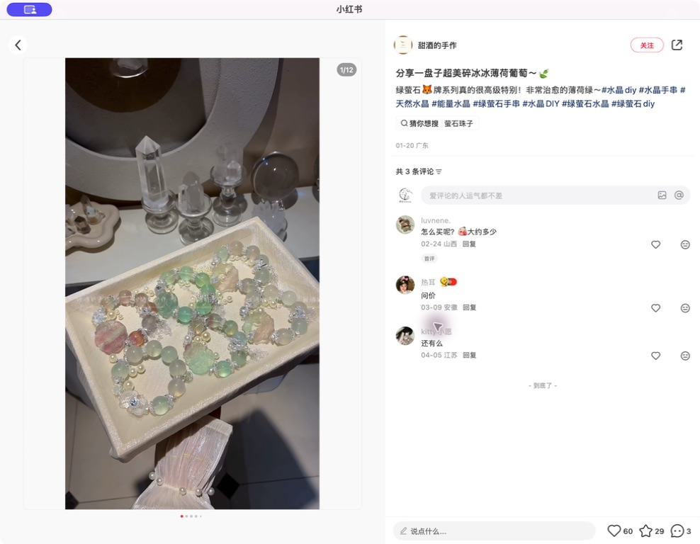

来源：[@甜酒的手作](http://xhslink.com/o/5dxfSqc6xyG) · 60 赞

- **构成**：绿萤石为主，混入浅紫萤石、白水晶与小型银饰，形成薄荷—葡萄双色。
- **设计理念**：利用萤石天然的绿紫过渡，做低饱和甜感，而不是鲜艳彩虹。
- **优化**：萤石硬度较低，不适合重吊坠；配件应轻，避免与硬物叠戴。
- **替换**：更耐用版本用东陵玉+紫水晶；保留绿 70%、紫 20%、白 10% 的比例。

## 20｜极简黑白灰：小手围设计

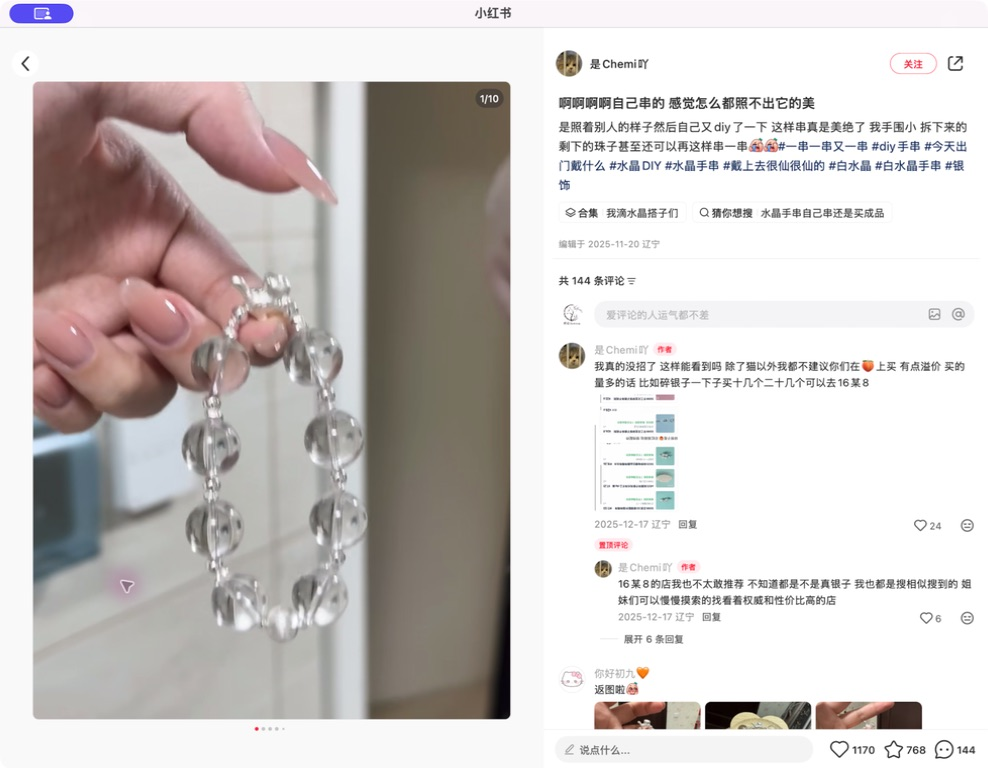

来源：[@是Chemi吖](http://xhslink.com/o/1xGYfewMeqG) · 1170 赞

- **构成**：透明白水晶为主，少量烟灰/黑珠和细银隔件点缀，珠径较统一。
- **设计理念**：高透明主材拉开留白，黑色只负责定锚，适合日常通勤。
- **优化**：小手围不要强行塞满大珠；建议 8—10mm，并用 2 颗深色珠对称或错位。
- **替换**：烟灰珠用茶晶，黑珠用黑曜石，银隔件可改 925 银素圈。

## 21｜浅紫自由多宝：没关系，我会自己 DIY

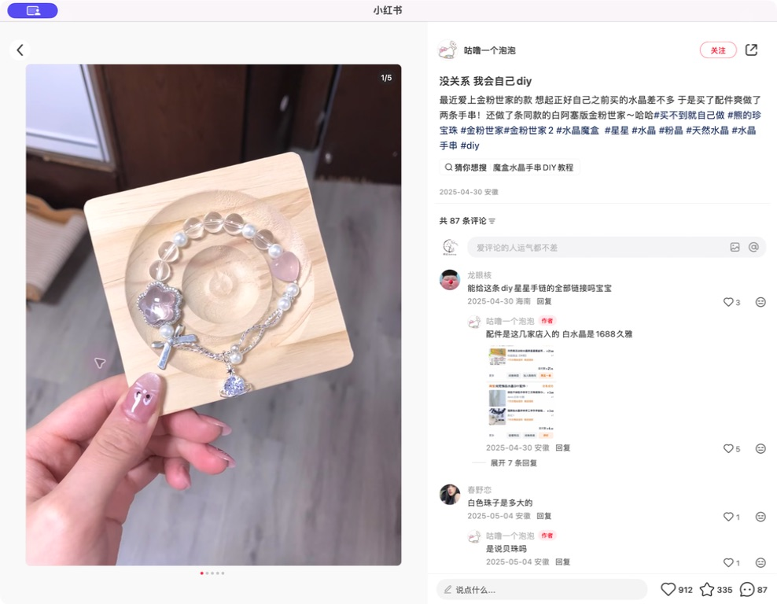

来源：[@咕噜一个泡泡](http://xhslink.com/o/9y2DHqRhule) · 912 赞

- **构成**：浅紫、白透、浅蓝珠混搭，加入方形主珠和短链坠，色彩都处在低饱和区。
- **设计理念**：综合色但不杂乱的关键，是所有颜色共享“浅、透、冷”的属性。
- **优化**：异形珠与吊坠二选一做主角；颜色控制在紫、白、蓝三种。
- **替换**：紫水晶+白水晶+海蓝宝即可完成，避免加入更多冷门多宝珠。

## 22｜白水异形模块：一周 DIY 合集

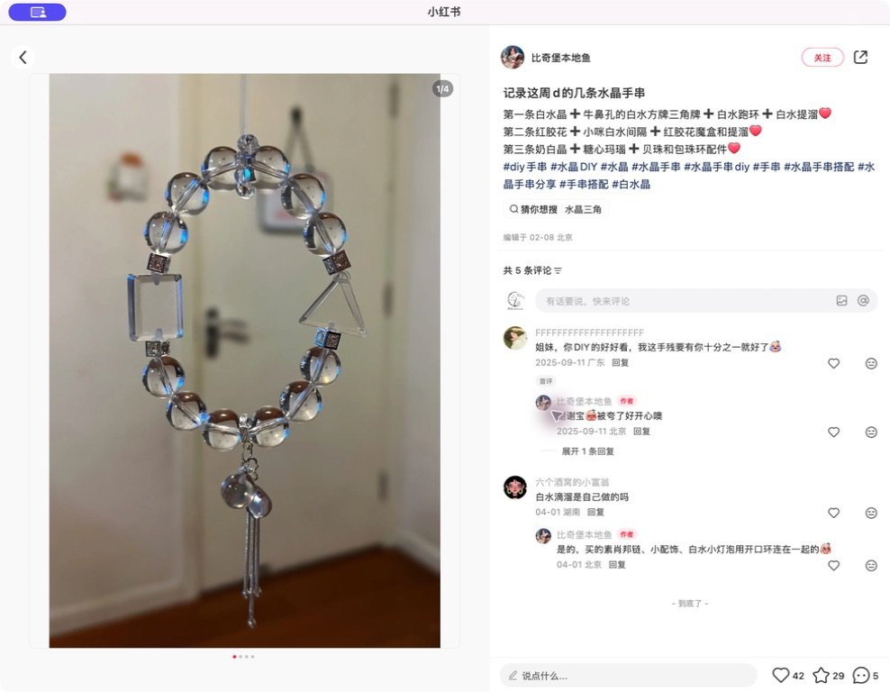

来源：[@比奇堡本地鱼](http://xhslink.com/o/70oXCNNBLd6) · 42 赞

- **构成**：白水晶圆珠为底，方牌、三角牌、跑环和小提溜像组件一样替换；同结构可换红胶花等主材。
- **设计理念**：建立“圆珠基底 + 1 个主异形 + 1 个小吊坠”的可复制模板。
- **优化**：不要同时使用方牌、三角牌和多个提溜；每串限制为一主一辅，减少廉价感。
- **替换**：红胶花版本可改石榴石或草莓晶，常见度和供应稳定性更好。

## 23｜粉晶泡泡：双圈叠戴

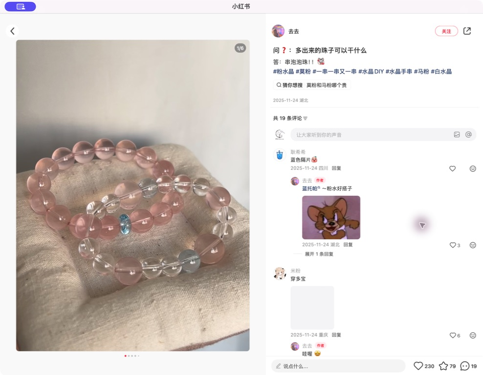

来源：[@去去](http://xhslink.com/o/4nx1mHoE35q) · 230 赞

- **构成**：两圈粉晶/马粉圆珠，透明白水晶和少量浅蓝小珠作为间隔，几乎无大配件。
- **设计理念**：通过双圈叠戴形成体量，单圈本身保持简单，适合利用余珠。
- **优化**：两圈不要完全同款；一圈全粉、一圈粉+白水，叠戴层次更明显。
- **替换**：马粉可换普通粉晶；蓝色小珠换海蓝宝或蓝纹玛瑙。

## 24｜新中式绿黑：微竹

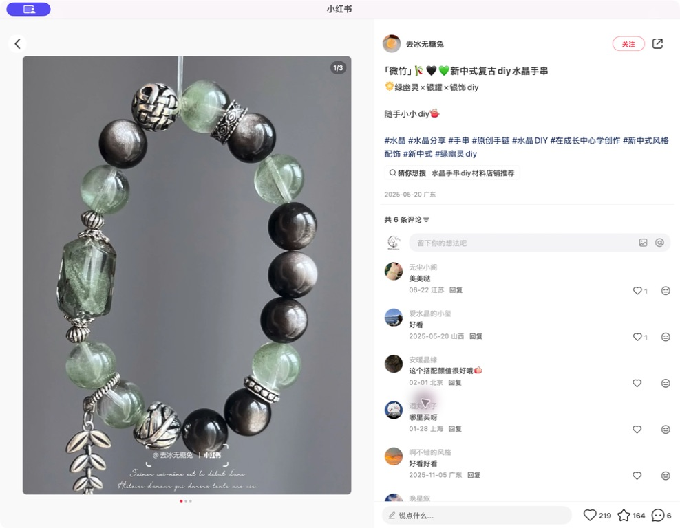

来源：[@去冰无糖兔](http://xhslink.com/o/9fQ0kNLuSUA) · 219 赞

- **构成**：银曜石/黑曜石与浅绿珠分段排列，中间用一颗大号绿色切面主珠，配银色竹叶坠。
- **设计理念**：黑色提供新中式骨架，绿色表达竹，银饰承担主题符号。
- **优化**：黑绿比例建议 5:4；大主珠与竹叶坠不要紧挨，避免正面过重。
- **替换**：绿幽灵可换东陵玉或绿萤石；银曜石换黑曜石，仍保留绿黑主题。

## 25｜月相蓝光：蓝月光 DIY

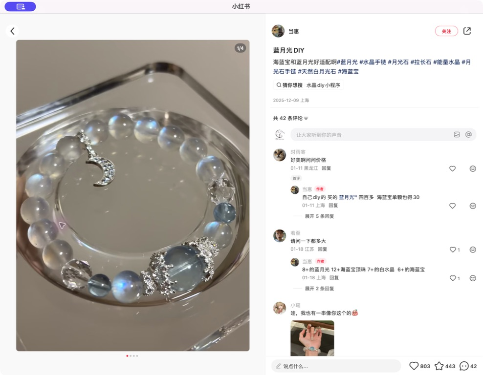

来源：[@当崽](http://xhslink.com/o/2sCf71UN80r) · 803 赞

- **构成**：蓝月光/灰月光圆珠近乎素圈，正面加入月牙和圆月两枚银色天体配件。
- **设计理念**：珠材本身有蓝光，配件只把“月相”概念说清楚，不增加多色。
- **优化**：两枚配件缩为一主一辅，最大配件宽度不超过主珠直径的 1.5 倍。
- **替换**：蓝月光不足时，用白月光+1—2 颗拉长石；也可混少量白水晶提高亮度。

## 26｜抹茶奶酪：绿白两段式

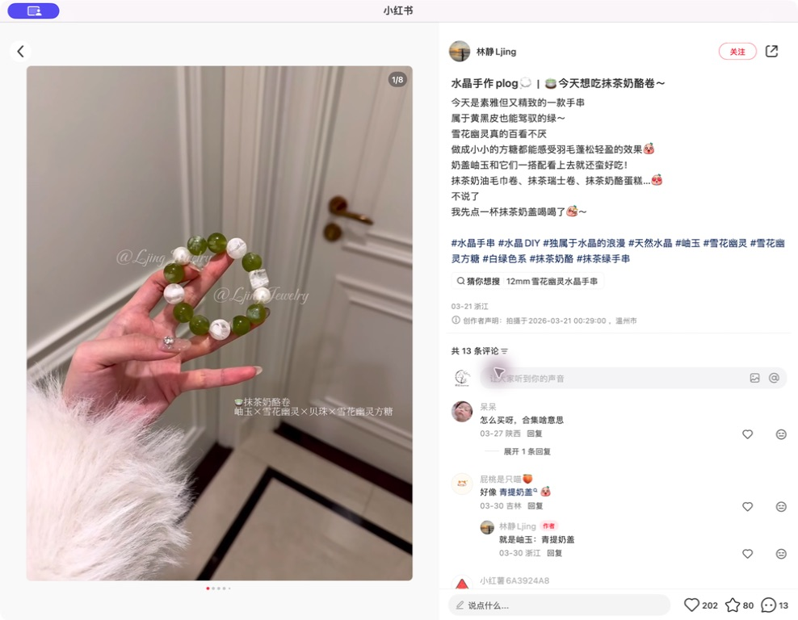

来源：[@林静Ljing](http://xhslink.com/o/3YtfCH5YSuB) · 202 赞

- **构成**：橄榄/抹茶绿珠为主体，奶白珠形成短段，少量粉灰或透明珠做连接。
- **设计理念**：食品命名对应稳定的两色配方——抹茶绿与奶油白，容易理解和传播。
- **优化**：去掉多余粉灰色，只保留绿 70% + 白 30%；正面用一颗白色主珠做“奶酪芯”。
- **替换**：绿幽灵可换东陵玉、橄榄石或绿萤石；奶白用白月光/白玉髓。

## 27｜蓝绿香槟：云中岛屿

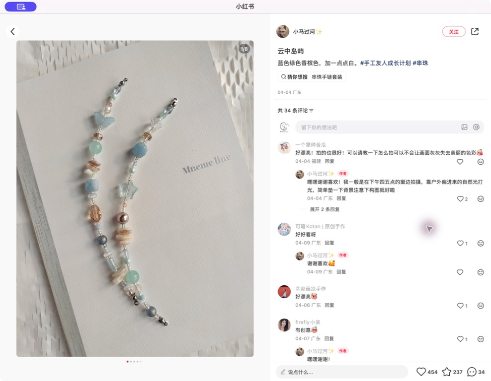

来源：[@小马过河✨](http://xhslink.com/o/A4twzv4gjd4) · 454 赞

- **构成**：浅蓝、浅绿、香槟黄和白色小珠以不规则节奏排列，搭配细链和小坠，整体纤细。
- **设计理念**：用“天空—植被—沙滩—云”四个自然色块叙事，色彩丰富但明度接近。
- **优化**：手串版应减少链长，将四种颜色压缩为蓝绿主色、白色过渡、香槟色仅 2 颗。
- **替换**：海蓝宝+东陵玉+白水晶+黄水晶即可，不需要特殊珠种。

## 28｜极简紫白：紫色真有气质

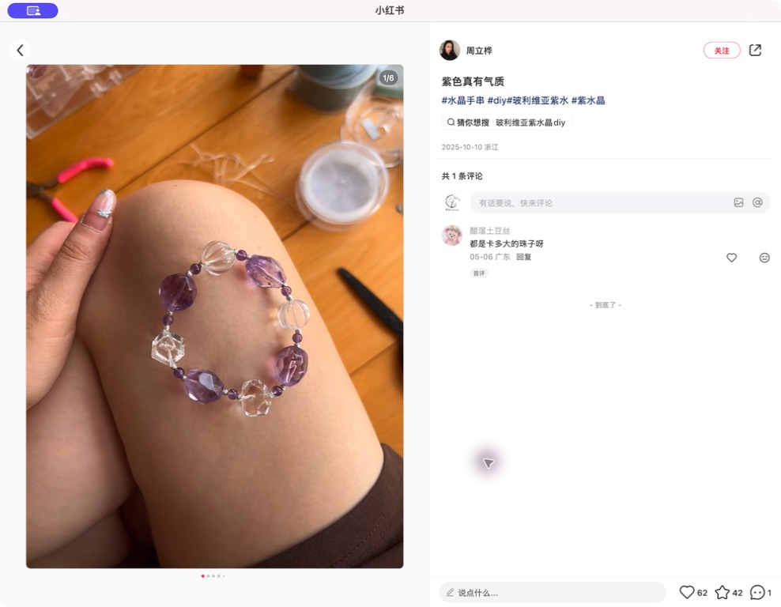

来源：[@周立桦](http://xhslink.com/o/9KWXubuOJPR) · 62 赞

- **构成**：紫水晶深浅两档与白水晶交替，少配件、统一圆珠，结构直接。
- **设计理念**：用紫色深浅而非复杂配饰体现成熟感，是最容易复刻的紫水晶基础款。
- **优化**：不要一深一浅机械交替；改为深紫 3 颗成组、浅紫/白水过渡，节奏更自然。
- **替换**：只需紫水晶+白水晶；高预算版可把 1 颗白水换白月光。

## 29｜奶油粉蓝：奶油芙蕾

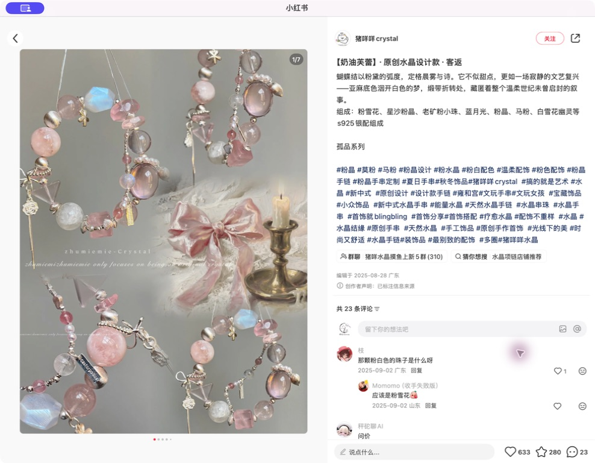

来源：[@猪咩咩crystal](http://xhslink.com/o/Ue20vY8rJc) · 633 赞

- **构成**：粉晶、奶白珠、浅蓝珠与银色蝴蝶结/花朵配件组成多套同主题设计。
- **设计理念**：把低饱和粉蓝做成轻法式“奶油感”，配件负责浪漫符号。
- **优化**：蝴蝶结、花朵、长坠只选一类；主珠以粉晶为主，浅蓝不超过 20%。
- **替换**：奶白用白月光，浅蓝用海蓝宝，粉色用粉晶/草莓晶，三种都常见。

## 30｜薰衣草同色阶：冰紫葡萄

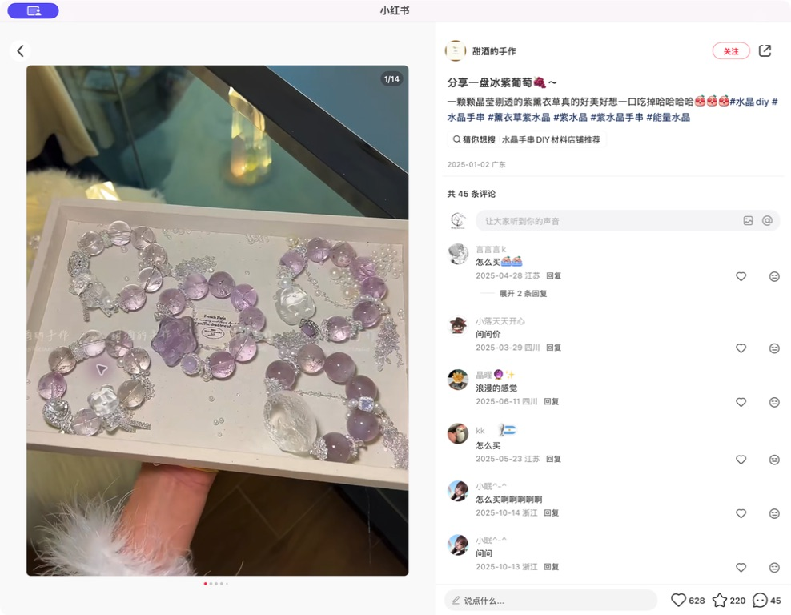

来源：[@甜酒的手作](http://xhslink.com/o/3NHkrmKGnA5) · 628 赞

- **构成**：浅薰衣草紫水晶、白水晶和少量银色花/动物配件组成系列款，整体低饱和高通透。
- **设计理念**：同色阶紫水晶通过透度和珠径区分，像一串冰葡萄。
- **优化**：基础款用 8—10mm 圆珠，只留 1 颗异形白水；主题配件做可选模块，不固定堆叠。
- **替换**：薰衣草紫水晶供应不稳时，用浅紫水晶+白水晶混排；颜色不够浅可降低紫珠占比。

---

## 面向宇涧的整体优化建议

### 1. 把 30 款收敛为 6 个可运营系列

| 系列 | 建议纳入款式 | 共用主材 | 视觉关键词 |
|---|---|---|---|
| 冰川白透 | 01、02、04、11、14、18、20、22 | 白水晶、月光石、茶晶 | 透明、冷银、留白 |
| 深海蓝调 | 03、05、10、16、25、27 | 海蓝宝、蓝月光、蓝纹玛瑙 | 深浅蓝、轨道、月相 |
| 柔粉花园 | 08、12、13、15、23、29 | 粉晶、草莓晶、紫水晶 | 奶油、花、泡泡 |
| 森林新中式 | 17、19、24、26 | 东陵玉、绿萤石、黑曜石 | 竹、抹茶、薄荷 |
| 大地金棕 | 09 | 虎眼石、茶晶、黄水晶 | 中性、光带、稳定 |
| 紫雾多宝 | 06、07、21、28、30 | 紫水晶、白水晶、灰月光 | 同色阶、星球、多宝 |

### 2. DIY 工作台建议提供 4 种结构模板

- **素圈变奏**：同珠径圆珠 + 1—3 颗焦点珠，覆盖 09、20、25、28。
- **三段式**：主色段/过渡段/焦点段，覆盖 03、05、10、13、16、26。
- **圆珠+异形**：只允许一个主异形和一个辅配件，覆盖 02、04、17、18、22。
- **链式留白**：需要金属连接，作为进阶模板，覆盖 11、27、29。

### 3. 珠子替换优先级

| 原参考中相对小众或成本波动大的珠材 | 建议常用替代 | 原因 |
|---|---|---|
| 粉兔毛、紫幽灵 | 粉晶 + 紫水晶 | 颜色接近，认知度高，供应稳定 |
| 绿阿塞 | 东陵玉或绿萤石 | 更常见，颜色一致性更好 |
| 蓝兔毛、深蓝猫眼晶石 | 蓝纹玛瑙或深色海蓝宝 | 便于做深浅蓝层次 |
| 黑金超七 | 黑曜石 + 茶晶 | 降低价格与品控波动 |
| 大颗蜜蜡主珠 | 黄水晶或太阳石 | 保持暖黄焦点且仍属于水晶体系 |
| 高净大颗海蓝宝 | 普通海蓝宝 + 白水晶 | 用配色提升通透感，不依赖单珠等级 |

### 4. 避免的常见问题

- 同时出现大主珠、大吊坠、多个隔片和多种异形珠，会让高级感迅速下降。
- 颜色超过三种时，应统一明度或透明度，否则多宝会像余珠拼接。
- 16—18mm 大珠在图片中醒目，但小手围容易显重；主流商品建议以 8—12mm 为主。
- 萤石硬度较低，配件应轻，并在商品页提示避免碰撞与叠戴。
- 原帖的材质名不能仅凭图片确认；正式上架前仍需按实物、采购单和检测信息标注。

## 最适合先打样的 8 款

建议优先：02 山中小雪、07 宇宙行星单圈版、10 深海星轨、13 粉绿撞色、20 黑白灰经典、24 微竹、25 蓝月光 DIY、30 冰紫葡萄。

这 8 款覆盖白、蓝、粉、绿、黑、紫六种主流需求；珠材常见，结构差异明显，也便于在 DIY 工作台做模板化推荐。
